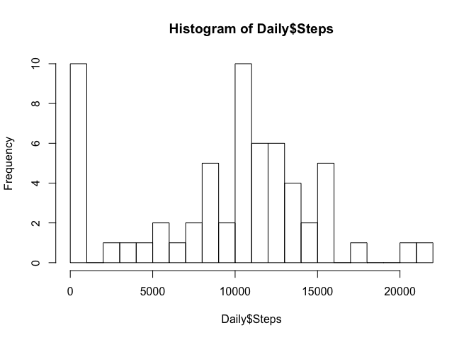
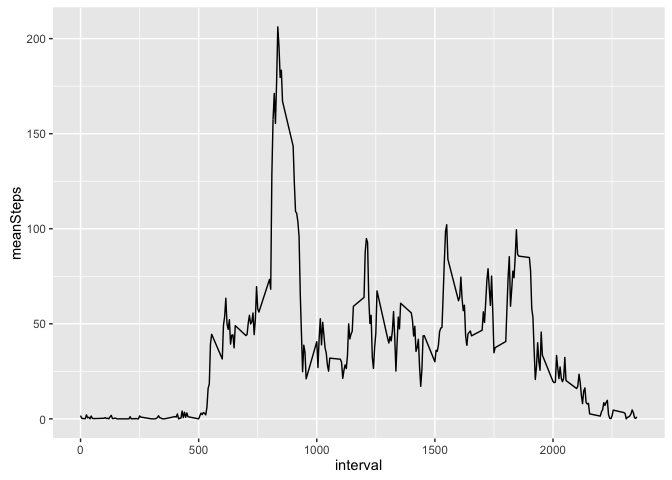
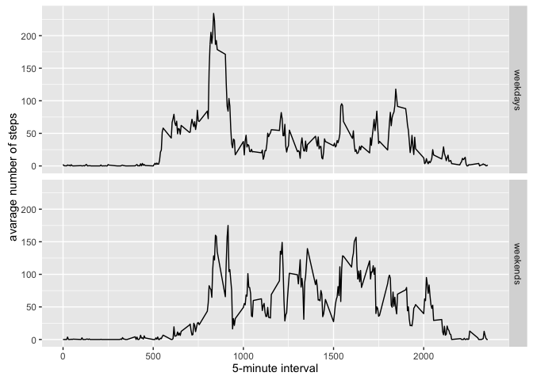

# Reproducible Research: Peer Assessment 1


## Loading and preprocessing the data
Reading the data using read.csv()

```r
if(!file.exists('activity.csv')){
    unzip('activity.zip')
}
Data <- read.csv('activity.csv')
```


## What is mean total number of steps taken per day?

Using as.Date function to change the data type of Date variable. And making the histogram.

```r
Data$date <- as.Date(Data$date)
Daily <- rowsum(Data$steps,Data$date, na.rm = TRUE)
Daily <- data.frame(Daily)
names(Daily) <- "Steps"
hist(Daily$Steps, breaks = 20)
```


### Mean and Median 
Mean and Median of total steps per day is calculated:

```r
mean(Daily$Steps)
```

```
## [1] 9354.23
```

```r
median(Daily$Steps)
```

```
## [1] 10395
```
* Mean: 9354.2295
* Median:  10395
## What is the average daily activity pattern?

Using aggregate() function, the average daily activity is found.

```r
Pattern <- aggregate(x=list(meanSteps=Data$steps), by=list(interval=Data$interval), FUN=mean, na.rm=TRUE)
```
### Making time series plot
Loading ggplot2 library to create the plot 

```r
library(ggplot2)
ggplot(data = Pattern,aes(x = interval, y = meanSteps)) +
  geom_line()
```


### interval that contains max number of average steps
The interval of max number of average steps is found using which.max() function

```r
Pattern[which.max(Pattern$meanSteps),]
```

```
##     interval meanSteps
## 104      835  206.1698
```
Most step at 8:35

## Imputing missing values
Calculated and reported the total number of missing values in the dataset


```r
Missing <- Data[which(is.na(Data$steps)),]
dim(Missing)
```

```
## [1] 2304    3
```
number of missing: 2304

Differences in activity patterns between weekdays and weekends
### Create a new variable with two levels
Using as.factor() function to add a new variable to separate the data into two groups

```r
Data$wday <- as.factor(ifelse(weekdays(Data$date) %in% c("Saturday","Sunday"),"weekends","weekdays"))
```
### Plotting


```r
pat_week <- aggregate( steps ~ interval + wday, data = Data, mean )
ggplot(pat_week,aes(interval, steps))+
geom_line()+
facet_grid(wday ~ .) +
xlab("5-minute interval") + 
ylab("avarage number of steps")
```


